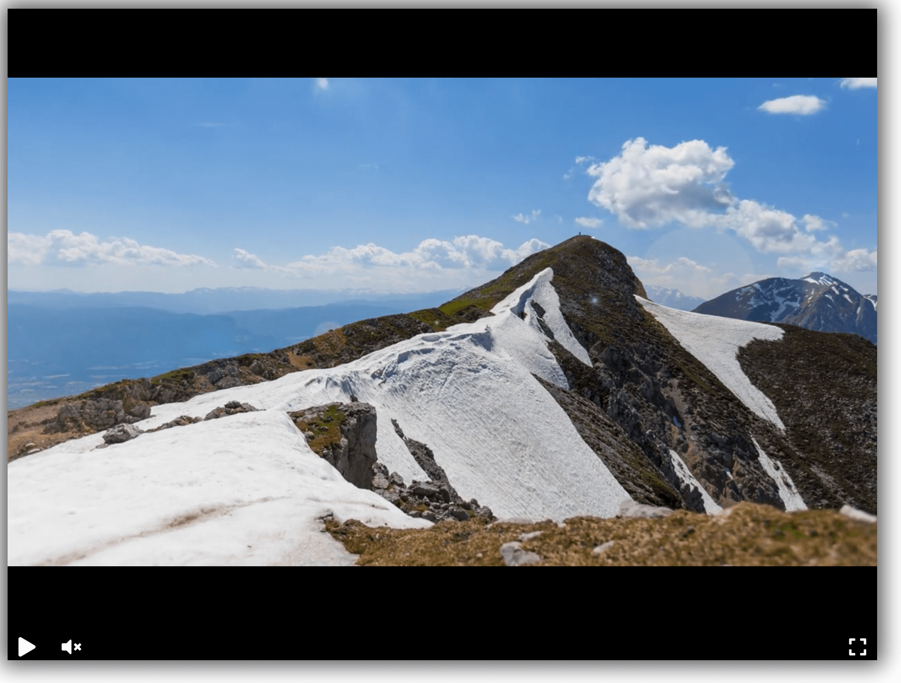

# Видеоплеер

[Пример готового плеера](https://tumkir.github.io/dvmn-player)



## Как запустить

Просто скопируйте репозиторий и откройте файл `src/index.html` в браузере.

Для комфортной разработки/тестирования можете установить Python пакет `livereload` — cтраница в браузере будет обновляться автоматически при каждом изменении в файле `index.html`.

```bash
pip install -r requirements.txt
```

Далее запустите [livereload cli](https://github.com/lepture/python-livereload#command-line-interface) с указанием папки, в которой лежит файл `index.html`.

```bash
livereload src
```

Сайт появится по адресу http://127.0.0.1:35729

## Цель проекта

Код написан в образовательных целях на онлайн-курсе для веб-разработчиков [dvmn.org](https://dvmn.org/).